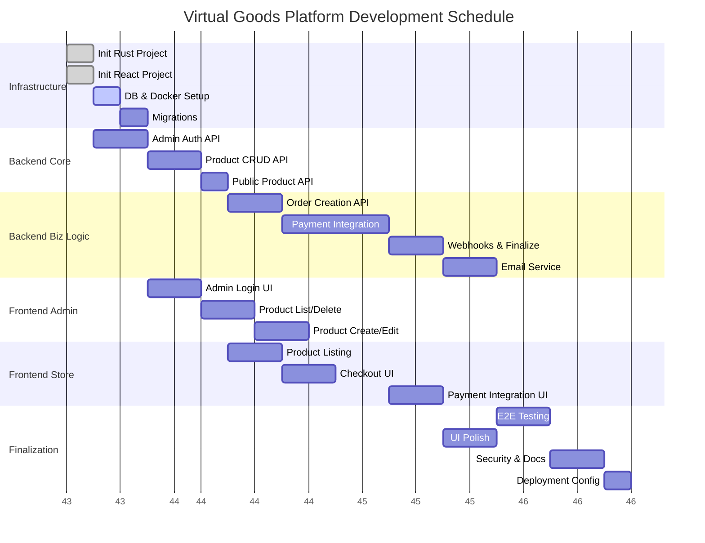

# Project Implementation Tasks

## 1. Project Summary

- **Project Name**: Virtual Goods Sales Platform
- **Architecture**: React (Frontend) + Rust (Backend) + PostgreSQL (Database)
- **Total Tasks**: 22
- **Estimated Total Effort**: ~140 Hours
- **Phases**: 6

## 2. Task List

### Phase 1: Infrastructure & Setup (Week 1)

#### TASK-0001: Initialize Rust Backend Project
- **Description**: Set up the Rust workspace with Actix-web or Axum, configure logging, and error handling.
- **Type**: DIRECT
- **Dependencies**: None
- **Estimated Time**: 4h
- **Test Requirements**: Run `cargo run` successfully; logs are visible.
- **Completion Criteria**: Hello World endpoint reachable; project structure follows standard Rust conventions.

#### TASK-0002: Initialize React Frontend Project
- **Description**: Set up React with Vite, TypeScript, and install Ant Design. Configure proxy to backend.
- **Type**: DIRECT
- **Dependencies**: None
- **Estimated Time**: 4h
- **Test Requirements**: `npm run dev` launches page; Ant Design component renders.
- **Completion Criteria**: Project compiles; basic folder structure (src/components, src/pages) created.

#### TASK-0003: Database & Docker Setup
- **Description**: Create `docker-compose.yml` for PostgreSQL. Configure environment variables for DB connection.
- **Type**: DIRECT
- **Dependencies**: None
- **Estimated Time**: 4h
- **Test Requirements**: `docker-compose up` starts DB; accessible via connection string.
- **Completion Criteria**: DB container running; `.env` file configured.

#### TASK-0004: Database Migrations
- **Description**: Implement migration scripts for `products`, `orders`, and `admins` tables using `sqlx` or similar tool.
- **Type**: DIRECT
- **Dependencies**: TASK-0003
- **Estimated Time**: 6h
- **Test Requirements**: Migrations apply successfully; rollback works.
- **Completion Criteria**: Database schema matches `storage-schema.md`.

### Phase 2: Backend Core (Week 2)

#### TASK-0005: Admin Authentication API
- **Description**: Implement `POST /api/admin/login` with JWT generation and Argon2 password verification.
- **Type**: TDD
- **Dependencies**: TASK-0001, TASK-0004
- **Estimated Time**: 8h
- **Test Requirements**: Unit tests for password hashing; integration test for login endpoint.
- **Completion Criteria**: Valid credentials return JWT; invalid return 401.

#### TASK-0006: Product Management API (Admin)
- **Description**: Implement CRUD endpoints for products (`GET/POST/PUT/DELETE /api/admin/products`). Secure with JWT middleware.
- **Type**: TDD
- **Dependencies**: TASK-0005
- **Estimated Time**: 10h
- **Test Requirements**: Test CRUD operations; test unauthorized access denial.
- **Completion Criteria**: Admins can manage products including `download_link`.

#### TASK-0007: Public Product API
- **Description**: Implement `GET /api/products` and `GET /api/products/:id`. **Ensure `download_link` is excluded from response.**
- **Type**: TDD
- **Dependencies**: TASK-0006
- **Estimated Time**: 6h
- **Test Requirements**: Response JSON checks; assert `download_link` is missing.
- **Completion Criteria**: Public endpoints return correct product data.

### Phase 3: Backend Business Logic (Week 3)

#### TASK-0008: Order Creation API
- **Description**: Implement `POST /api/orders`. Create `pending` order in DB.
- **Type**: TDD
- **Dependencies**: TASK-0007
- **Estimated Time**: 8h
- **Test Requirements**: Order saved to DB; returns Order ID.
- **Completion Criteria**: Valid requests create database records.

#### TASK-0009: Payment Gateway Integration Service
- **Description**: Create service layer to interface with Alipay/WeChat/Wise/Apple Pay (start with Mocks/Simulators). Generate payment URLs.
- **Type**: TDD
- **Dependencies**: TASK-0008
- **Estimated Time**: 16h
- **Test Requirements**: Mock gateway returns valid URLs; Integration tests with sandbox accounts if available.
- **Completion Criteria**: `POST /api/orders` returns payment URL/QR data.

#### TASK-0010: Webhook Handling & Order Finalization
- **Description**: Implement `POST /api/webhooks/:provider`. Verify signature, update order status to `paid`.
- **Type**: TDD
- **Dependencies**: TASK-0009
- **Estimated Time**: 10h
- **Test Requirements**: Simulated webhook updates order status; idempotent handling.
- **Completion Criteria**: Order status transitions from `pending` to `paid` upon valid webhook.

#### TASK-0011: Email Delivery Service
- **Description**: Integrate SMTP/Email API (SendGrid/Mailgun). Send email with link when order is `paid`.
- **Type**: TDD
- **Dependencies**: TASK-0010
- **Estimated Time**: 8h
- **Test Requirements**: Mock email sending in tests; verify email content includes link.
- **Completion Criteria**: "Paid" order triggers email dispatch.

### Phase 4: Frontend Admin (Week 4)

#### TASK-0012: Admin Login Page
- **Description**: Create login form. Store JWT in LocalStorage/Cookie. Handle redirects.
- **Type**: TDD
- **Dependencies**: TASK-0005, TASK-0002
- **Estimated Time**: 6h
- **Test Requirements**: Successful login redirects to dashboard; error shows message.
- **Completion Criteria**: functional login page.

#### TASK-0013: Admin Product List & Delete
- **Description**: Display products in Ant Design Table. Implement Delete action.
- **Type**: TDD
- **Dependencies**: TASK-0006, TASK-0012
- **Estimated Time**: 8h
- **Test Requirements**: List renders data from API; Delete removes item from UI.
- **Completion Criteria**: Admins can view and delete products.

#### TASK-0014: Admin Product Create/Edit
- **Description**: Modal or Page with Form for Product fields (including Link).
- **Type**: TDD
- **Dependencies**: TASK-0013
- **Estimated Time**: 8h
- **Test Requirements**: Form validation; submit calls API.
- **Completion Criteria**: Admins can add/edit products.

### Phase 5: Frontend Storefront (Week 5)

#### TASK-0015: Public Product Listing
- **Description**: Responsive grid/list of products.
- **Type**: TDD
- **Dependencies**: TASK-0007
- **Estimated Time**: 6h
- **Test Requirements**: Renders list; loading states.
- **Completion Criteria**: Buyers can see products.

#### TASK-0016: Product Detail & Checkout Modal
- **Description**: Detail view + "Buy" button opening Email input form.
- **Type**: TDD
- **Dependencies**: TASK-0015
- **Estimated Time**: 8h
- **Test Requirements**: Modal opens; Validation on email input.
- **Completion Criteria**: User can start checkout process.

#### TASK-0017: Payment Integration UI
- **Description**: Payment method selection. Handle form submission to `POST /api/orders` and redirect to payment URL.
- **Type**: TDD
- **Dependencies**: TASK-0016, TASK-0009
- **Estimated Time**: 8h
- **Test Requirements**: Submission redirects user or shows QR code.
- **Completion Criteria**: End-to-end checkout flow initiation.

### Phase 6: Integration & Polish (Week 6)

#### TASK-0018: End-to-End Testing (Purchase)
- **Description**: Manual or Automated test of full flow: Buy -> Pay (Sandbox) -> Email.
- **Type**: DIRECT
- **Dependencies**: All previous
- **Estimated Time**: 6h
- **Test Requirements**: Verify email delivery in sandbox.
- **Completion Criteria**: Flow confirmed working.

#### TASK-0019: UI/UX Polish
- **Description**: Improve styling, mobile responsiveness, loading skeletons, error messages.
- **Type**: DIRECT
- **Dependencies**: Frontend tasks
- **Estimated Time**: 8h
- **Test Requirements**: Mobile check; Lighthouse audit.
- **Completion Criteria**: Professional look and feel.

#### TASK-0020: Security Audit & Optimization
- **Description**: Review code for secrets, ensure DB indexes, API rate limiting.
- **Type**: DIRECT
- **Dependencies**: All Code
- **Estimated Time**: 6h
- **Test Requirements**: Security scan.
- **Completion Criteria**: Secure codebase.

#### TASK-0021: Documentation & Handover
- **Description**: Update README, write deployment guide.
- **Type**: DIRECT
- **Dependencies**: None
- **Estimated Time**: 4h
- **Test Requirements**: N/A
- **Completion Criteria**: Documentation complete.

#### TASK-0022: Deployment Configuration
- **Description**: Finalize Dockerfile, Nginx config.
- **Type**: DIRECT
- **Dependencies**: TASK-0003
- **Estimated Time**: 4h
- **Test Requirements**: `docker build` succeeds.
- **Completion Criteria**: Ready for production deploy.

## 3. Timeline (Gantt Chart)

